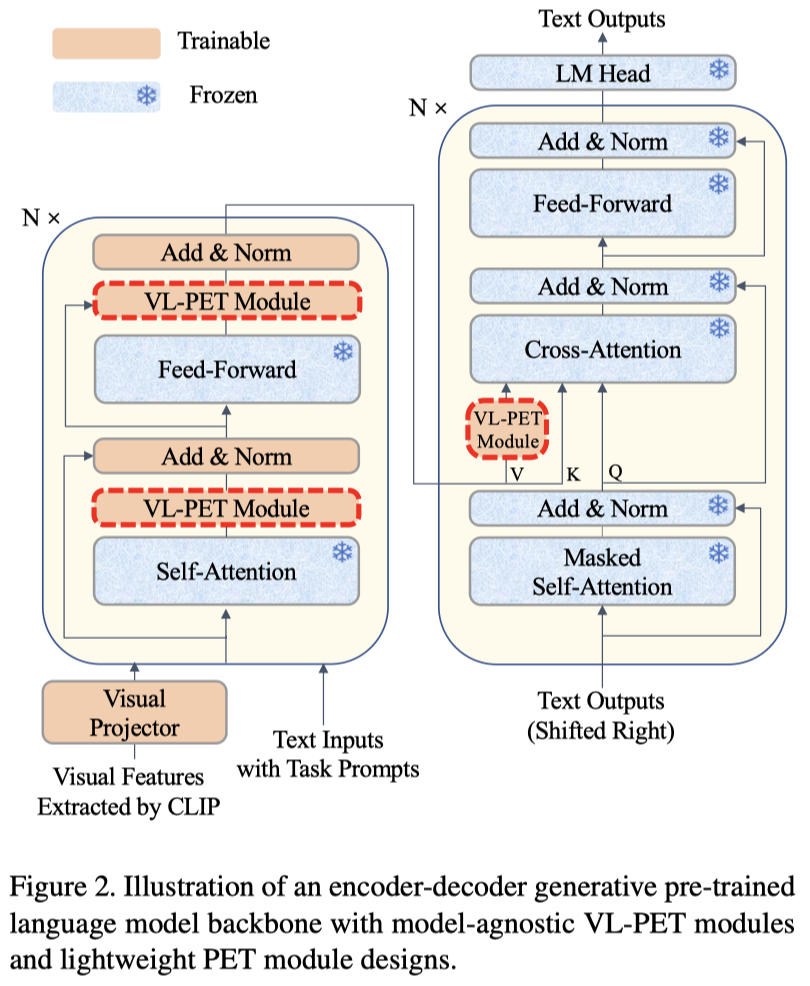
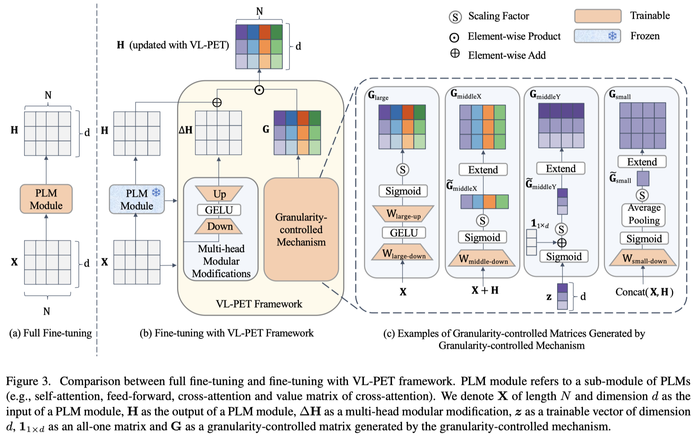
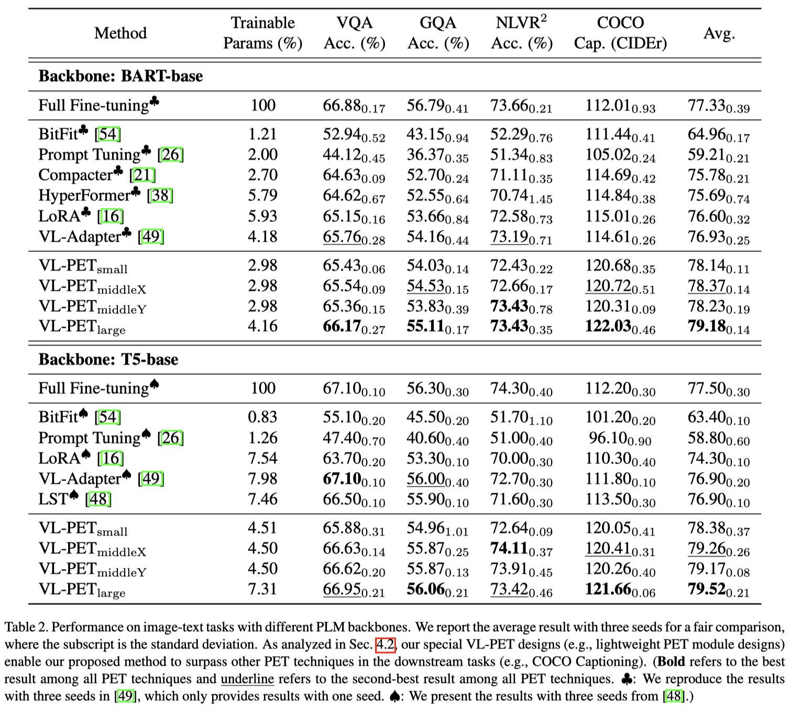

# VL-PET

<p align="center">
    <a href="https://henryhzy.github.io/VL-PET/"></a>
</p>


Official code for "VL-PET: Vision-and-Language Parameter-Efficient Tuning via Granularity Control" (ICCV2023)

Authors: [Zi-Yuan Hu](https://henryhzy.github.io/)<sup>1,3</sup>, [Yanyang Li](https://scholar.google.com/citations?user=bojU9LoAAAAJ/)<sup>1</sup>, [Michael R. Lyu](https://www.cse.cuhk.edu.hk/lyu/)<sup>1</sup> and [Liwei Wang](https://lwwangcse.github.io/)<sup>\*1,2</sup> (<sup>*</sup>Corresponding Author)

<strong>
<sup>1</sup>The Chinese University of Hong Kong<br>
<sup>2</sup>Centre for Perceptual and Interactive Intelligence<br>
<sup>3</sup>Shanghai AI Laboratory<br>
</strong>

<br>
<a href='https://henryhzy.github.io/VL-PET'></a> 
<a href='https://arxiv.org/abs/xxxx.xxxx'></a> 
<a href='https://arxiv.org/abs/xxxx.xxxx'></a> 
<a href='https://opensource.org/licenses/MIT'></a> 
<a href="https://hits.seeyoufarm.com"></a>

<br>
Project page (with more details and fun fact of our logo): [VL-PET](https://henryhzy.github.io/VL-PET)

## Abstract

As the model size of pre-trained language models (PLMs) grows rapidly, full fine-tuning becomes prohibitively expensive for model training and storage. In vision-and-language (VL), parameter-efficient tuning (PET) techniques are proposed to integrate modular modifications (e.g., Adapter and LoRA) into encoder-decoder PLMs. By tuning a small set of trainable parameters, these techniques perform on par with full fine-tuning. However, excessive modular modifications and neglecting the functionality gap between the encoders and decoders can lead to performance degradation, while existing PET techniques (e.g., VL-Adapter) overlook these critical issues. 

In this paper, we propose a **V**ision-and-**L**anguage **P**arameter-**E**fficient **T**uning (**VL-PET**) framework to impose effective control over modular modifications via a novel granularity-controlled mechanism. Considering different granularity-controlled matrices generated by this mechanism, a variety of model-agnostic VL-PET modules can be instantiated from our framework for better efficiency and effectiveness trade-offs. We further propose lightweight PET module designs to enhance VL alignment and modeling for the encoders and maintain text generation for the decoders. 

Extensive experiments conducted on four image-text tasks and four video-text tasks demonstrate the efficiency, effectiveness and transferability of our VL-PET framework. In particular, our VL-PET-large with lightweight PET module designs significantly outperforms VL-Adapter by 2.92% (3.41%) and LoRA by 3.37% (7.03%) with BART-base (T5-base) on image-text tasks. Furthermore, we validate the enhanced effect of employing our VL-PET designs on existing PET techniques, enabling them to achieve significant performance improvements.


## VL-PET Framework

<p align="center">
    <br>
</p>


<p align="center">
    
</p>

## Experiments

<p align="center">
    <br>
</p>


<p align="center">
    
</p>

<p align="center">
    
</p>

## Quick Start
### 1. Installation
```
conda create -n vlpet
conda activate vlpet
pip install -r requirements.txt
python -c "import language_evaluation; language_evaluation.download('coco')"
```
<details>
<summary>Click for more details... </summary>

More details about the installation:
```bash
GPU: A100 (80GB)
Driver Version: 470.129.06
CUDA Version: 11.4
python: 3.8.13
torch: 1.8.0+cu111
torchvision: 0.9.0+cu111
transformers: 4.2.1
```
</details> 


### 2. Dataset Preparation

You are recommended to follow the dataset downloading instruction of [VL-Adapter](https://github.com/ylsung/VL_adapter). 

The following is the file structure of the datasets for your convenience:

<details>
<summary>Click for more details... </summary>

```bash
datasets/    <= for dataset downloading, please refer to VL-Adapter
    ├── COCO
    │   └── clip_features
    ├── GQA
    │   └── clip_features
    ├── lxmert
    ├── nlvr
    │   └── clip_features
    ├── paragraphs
    ├── VG
    │   └── clip_features
    ├── video
    │   ├── ann
    │   │   ├── how2qa
    │   │   ├── how2r
    │   │   ├── tvc
    │   │   ├── tvqa
    │   │   ├── tvr
    │   │   ├── yc2c
    │   │   └── yc2r
    │   └── vis_features
    │       ├── how2
    │       │   └── clip-vit
    │       ├── tv
    │       │   └── clip-vit
    │       └── yc2
    │           └── clip-vit
    └── vqa
```
</details> 


### 3. Training & Evaluation (VL-PET-large)
Taking VL-PET-large as an example, we can conduct training and evaluation on different tasks as follows:

- VL-PET-large on image-text tasks (BART-base)
  ```bash
  # VL-PET-large on image-text tasks (BART-base)
  bash scripts/image-text/VL-PET-large.sh 20000 96 4 96 96 1e-3 42
  ```

  <details>
  <summary>Click for more details... </summary>

  The content of scripts/image-text/VL-PET-large.sh:
  ```bash
  task=multitask
  model="bart"
  echo $model
  
  if [ $model == "t5" ]
  then
      folder_prefix="VLT5"
      backbone="t5-base"
      batch_size=300
  elif [ $model == "bart" ]
  then
      folder_prefix="VLBart"
      backbone="facebook/bart-base"
      batch_size=500
  fi
  
  echo $folder_prefix
  echo $backbone
  
  feature=RN101
  
  lr=$6
  sh=Encoder_MultiheadDownAdapter_dim$2_head$3_GatingLowRankLN_dim$4_Decoder_VPAdapter_dim$5_lr$6_seed$7
  name=${sh}_${feature}__bs${batch_size}_image224_lr${lr}
  output=snap/${folder_prefix}_${task}/$name
  
  TOKENIZERS_PARALLELISM=True PYTHONPATH=$PYTHONPATH:./src \
  python -m torch.distributed.launch \
      --nproc_per_node=1 \
      --master_port=$1 \
      src/${task}.py \
      --distributed --multiGPU \
      --optim adamw \
      --warmup_ratio 0.1 \
      --clip_grad_norm 5 \
      --lr ${lr} \
      --epochs 20 \
      --num_workers 4 \
      --backbone ${backbone} \
      --output $output \
      --num_beams 5 \
      --batch_size ${batch_size} \
      --valid_batch_size ${batch_size} \
      --reduction_factor 8 \
      --use_tasks_prompts \
      --tasks "vqa,gqa,nlvr,caption" \
      --feature ${feature} --n_boxes 36 --downsample \
      --image_size "(224,224)" \
      --run_name $name \
      --use_adapter \
      --use_single_adapter \
      --no_encoder_adapter \
      --use_adapter_down_dim \
      --use_encoder_adapter_down_multihead \
      --adapter_down_dim $2 \
      --encoder_adapter_multihead_num_head $3 \
      --use_encoder_adapter_gating_large_x_lowrank \
      --adapter_gating_down_dim $4 \
      --unfreeze_encoder_layer_norms \
      --no_decoder_adapter \
      --use_decoder_enc_attn_value_parallel_adapter_down_dim \
      --decoder_enc_attn_value_parallel_adapter_down_dim $5 \
      --seed $7
  ```

  Since our code is built upon VL-Adapter, some arguments of VL-Adapter have been preserved for the convenience of conducting extensive experiments.

  For the arguments of the running command, you can refer to src/param.py. The following is the description of some selected arguments:
  ```bash
  backbone="facebook/bart-base" # use bart-base, hidden dimension d = 768
  batch_size=500  # batch size
  feature=RN101 # visual features
  --lr ${lr} # learning rate
  --warmup_ratio 0.1 # warmup ratio
  --epochs 20 # training epochs
  --output $output # to store the results
  --use_tasks_prompts # use task prompts
  --tasks "vqa,gqa,nlvr,caption" # multi-task learning
  --seed $7 # use three different seeds, such as 42, 43 and 9595
  
  # use shared-weight adapter-like modules
  --use_single_adapter 
  
  # for encoder VL-PET module
  # encoders: r = 96, s = 1.0, N_h= 4
  --no_encoder_adapter 
  --use_adapter_down_dim 
  --use_encoder_adapter_down_multihead 
  --adapter_down_dim $2 
  --encoder_adapter_multihead_num_head $3 
  --use_encoder_adapter_gating_large_x_lowrank 
  --adapter_gating_down_dim $4 
  --unfreeze_encoder_layer_norms 
  
  # for decoder VL-PET module
  # decoders: r = 96, s = 1.0, N_h= 1
  --no_decoder_adapter 
  --use_decoder_enc_attn_value_parallel_adapter_down_dim 
  --decoder_enc_attn_value_parallel_adapter_down_dim $5 
  ```
  </details> 


- VL-PET-large on image-text tasks (T5-base)
  ```bash
  # VL-PET-large on image-text tasks (T5-base)
  bash scripts/image-text/T5-VL-PET-large.sh 20001 192 4 192 0.3 96 3e-4 42
  ```

- VL-PET-large on video-text tasks (BART-base)
  ```bash
  # VL-PET-large on video-text tasks (BART-base)
  bash scripts/video-text/VL-PET-large.sh 20002 96 4 96 96 7e-4 20 42
  ```


## Code Structure

The following is the file structure of VL-PET project for your convenience:
<details>
<summary>Click for more details... </summary>

```bash
./datasets/  <= the details are listed in the section of Dataset Preparation
    ├──...
    └──...

./VL-PET/
    ├── src/    <= store code implementation for VL-PET and state-of-the-art baselines based on BART-base and T5-base
    └── scripts
        ├── image-text    <= store scripts for running on image-text tasks
        └── scripts/video-text    <= store scripts for running on video-text tasks
```
</details> 


## Running Command
For other experiments, we can replace `VL-PET-large` in the `.sh` file name with `VL-PET-middleX`, `VL-PET-middleY`, `VL-PET-small`, `full_finetuning`, `bitfit` and so on.
The details of the hyper-parameters are reported in the appendix of our paper.

### 1. VL-PET-large
Please refer to Quick Start.

### 2. VL-PET-middleX

<details>
  <summary>Click for more details... </summary>

  ```bash
  # VL-PET-middleX on image-text tasks (BART-base)
  bash scripts/image-text/VL-PET-middleX.sh 20000 96 4 96 1e-3 42

  # VL-PET-middleX on image-text tasks (T5-base)
  bash scripts/image-text/T5-VL-PET-middleX.sh 20001 192 4 0.3 96 3e-4 42

  # VL-PET-middleX on video-text tasks (BART-base)
  bash scripts/video-text/VL-PET-middleX.sh 20002 96 4 96 7e-4 20 42
  ```
</details> 

### 3. VL-PET-middleY

<details>
  <summary>Click for more details... </summary>

  ```bash
  # VL-PET-middleY on image-text tasks (BART-base)
  bash scripts/image-text/VL-PET-middleY.sh 20000 96 4 96 1e-3 42

  # VL-PET-middleY on image-text tasks (T5-base)
  bash scripts/image-text/T5-VL-PET-middleY.sh 20001 192 4 0.3 96 3e-4 42

  # VL-PET-middleY on video-text tasks (BART-base)
  bash scripts/video-text/VL-PET-middleY.sh 20002 96 4 96 7e-4 20 42
  ```
</details> 

### 4. VL-PET-small

<details>
  <summary>Click for more details... </summary>

  ```bash
  # VL-PET-small on image-text tasks (BART-base)
  bash scripts/image-text/VL-PET-small.sh 20000 96 4 96 1e-3 42

  # VL-PET-small on image-text tasks (T5-base)
  bash scripts/image-text/T5-VL-PET-small.sh 20001 192 4 0.3 96 3e-4 42

  # VL-PET-small on video-text tasks (BART-base)
  bash scripts/video-text/VL-PET-small.sh 20002 96 4 96 7e-4 20 42
  ```
</details> 

### 5. Baselines

<details>
  <summary>Click for more details... </summary>

  For baselines (e.g., full fine-tuning, VL-Adapter, compacter and so on), please refer to [VL-Adapter](https://github.com/ylsung/VL_adapter) and [Ladder-Side-Tuning](https://github.com/ylsung/Ladder-Side-Tuning).

</details> 


## Checkpoints & Logs

We provide checkpoints & logs for BART-base on image-text tasks as follows:

| Method | Params (%) | VQA (%) | GQA (%) | NLVR$^2$ (%) | COCO (CIDEr) | Avg.| Checkpoints & Logs |
| -------------- | ---------- | ------- | ------- | ------------ | ------------ | ----- | ------------------------------------------------------------ |
| VL-PET-small | 2.98 | 65.36 | 54.08 | 72.50| 121.07 | 78.25 | [Link](https://drive.google.com/drive/folders/1qpZy5nv8aPVj1HtVlcHQuPSN0kw_Jb8x?usp=drive_link) |
| VL-PET-middleX | 2.98 | 65.45 | 54.37 | 72.86| 121.09 | 78.44 |[Link](https://drive.google.com/drive/folders/1CU99ZAZP5fCCqUAWUUe76GCN_iyd5HLa?usp=drive_link)|
| VL-PET-middleY | 2.98 | 65.53 | 54.08 | 73.92| 120.20 | 78.43 |[Link](https://drive.google.com/drive/folders/1-VG_rTqGiiDQKmqvWPlZjsV-Og7uGeU8?usp=drive_link)|
| VL-PET-large | 4.16 | 66.40 | 54.94 | 73.36| 122.11 | 79.20 | [Link](https://drive.google.com/drive/folders/1B8L6kuM2kkc5Mkmz9HRV63DtCizzyJe8?usp=drive_link) |

## Acknowledgements
This work benefits from [VL-Adapter](https://github.com/ylsung/VL_adapter), [Ladder-Side-Tuning](https://github.com/ylsung/Ladder-Side-Tuning) and [unify-parameter-efficient-tuning](https://github.com/jxhe/unify-parameter-efficient-tuning). Our logo is borrowed from [OpenMoji](https://openmoji.org/library/emoji-1FA85/). Thanks for their awesome works!

## Reference
If you find VL-PET useful for your research, please consider giving this repository a star and citing our paper as follows:
```
@inproceedings{hu2023vlpet,
  title     = {VL-PET: Vision-and-Language Parameter-Efficient Tuning via Granularity Control},
  author    = {Zi-Yuan Hu, Yanyang Li, Michael R. Lyu and Liwei Wang},
  booktitle = {ICCV},
  year      = {2023}
}
```
